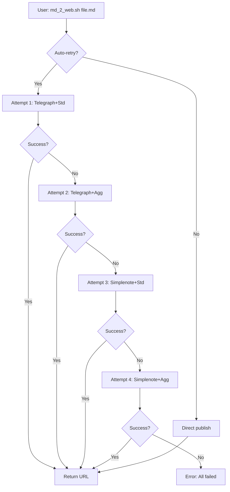

# API Publishing Retry with Cleaner

> Automatic retry mechanism for publishing markdown to web (Telegraph/Simplenote) with intelligent preprocessing levels and provider fallback.

## 📋 Project Summary

**Status:** In Progress  
**Last Updated:** 2026-01-04  
**Estimated Completion:** ~5-6 hours  
**Confidence:** ⭐⭐⭐⭐⭐ (5/5 - All requirements clear)

---

## 🎯 Problem Statement

Deep research creates complex markdown files that fail to publish because:

1. **Telegraph API rejects complex content**: Not based on file size, but on AST tree complexity
2. **Current system gives up immediately**: Tries once, no retry with different approaches
3. **Provider order is backwards**: Tries Simplenote first, then Telegraph (should be reverse)
4. **No preprocessing retry**: Either preprocessing works or fails, no fallback modes

**Real-world scenario:** User runs deep research, generates 27KB report, publishing fails with "Content is too big" error. Currently requires manual: `./md_2_web.sh --preprocess aggressive file.md`

**Desired:** Automatic retry with different (provider + preprocessing) combinations until success.

---

## ✨ Solution

Implement a 4-stage retry chain that intelligently tries different publishing strategies:

### Retry Chain Order

| Attempt | Provider | Preprocessing | Why This Order? |
|---------|----------|---------------|-----------------|
| 1 | **Telegraph** | **Standard** | Best case - clean URLs, good formatting |
| 2 | **Telegraph** | **Aggressive** | Strip HTML, preserve Telegraph if possible |
| 3 | **Simplenote** | **Standard** | Switch provider, try standard preprocessing |
| 4 | **Simplenote** | **Aggressive** | Last resort - reliable provider, stripped content |

**Key Principles:**
- Telegraph first (preferred for clean, public URLs)
- Standard preprocessing first (preserves formatting)
- Each provider gets 2 attempts (std → agg)
- Maximum 4 attempts, 120s timeout (30s each)

### Retry Behavior



### Auto-Retry Mode Detection

**Auto-retry is used when:**
- Provider is "auto" (default)
- No explicit `--preprocess` flag provided

**Direct mode is used when:**
- User specifies explicit provider (`--provider telegraph`)
- User specifies explicit preprocessing (`--preprocess standard`)

**Backward compatible:** Existing flags continue to work exactly as before.

---

## 📝 Files in This SDD

| File | Purpose |
|------|---------|
| `README.md` | This file - project overview |
| `raw-requirements.md` | Initial requirements from user |
| `requirements.md` | Detailed functional requirements |
| `ui-flow.md` | Technical flow & architecture diagrams |
| `gaps.md` | Gap analysis (100% filled) |
| `manual-e2e-test.md` | 10 manual test cases |
| `trello-cards/BOARD.md` | Board overview & card list |
| `trello-cards/KICKOFF.md` | AI Agent implementation guide |
| `trello-cards/01-12-*.md` | 12 implementation cards |

---

## 🎯 Requirements

### Functional Requirements

1. **Provider Order Reversal**
   - Try Telegraph first (preferred)
   - Fall back to Simplenote
   - Explicit provider selection skips retry

2. **Preprocessing Retry Chain**
   - Try standard preprocessing first
   - Try aggressive preprocessing on failure
   - Skip minimal/off modes (not useful for retry)

3. **4-Stage Retry Flow**
   - Telegraph + standard (attempt 1)
   - Telegraph + aggressive (attempt 2)
   - Simplenote + standard (attempt 3)
   - Simplenote + aggressive (attempt 4)

4. **Error Detection**
   - Detect "too big" errors (Telegraph)
   - Detect auth failures (stop immediately)
   - Detect timeouts (retry next combo)
   - Detect rate limits (retry with backoff)

5. **Monitoring**
   - Log each attempt (provider, mode, result)
   - Track attempt success rate
   - Log final result

### Non-Functional Requirements

1. **Performance**
   - 30s timeout per attempt
   - 120s max total time (4 attempts)
   - Exponential backoff: 2s, 4s, 8s max

2. **Backward Compatibility**
   - `--preprocess` flag still works as override
   - `--provider` flag still works as explicit selection
   - Old scripts continue working

3. **User Experience**
   - Transparent retry (user sees it working)
   - Clear logs for each attempt
   - Helpful error messages when all fail

---

## 🗂️ Implementation Cards

[See: trello-cards/BOARD.md for full details]

### Phase 1: Foundation (Cards 01-05) - **Setup**
- ✅ Card 01: Validate Project Configuration (15 min)
- ✅ Card 02: Understand CLI Structure (20 min)
- ✅ Card 03: Test Current Implementation (25 min)
- ✅ Card 04: Analyze Error Patterns (20 min)
- ✅ Card 05: Document Existing Flow (15 min)

### Phase 2: Core Implementation (Cards 06-09) - **Build**
- 🔄 Card 06: Build Retry Function Skeleton (30 min)
- 🔄 Card 07: Implement 4-Stage Retry Logic (45 min)
- 🔄 Card 08: Add Preprocessing Integration (30 min)
- 🔄 Card 09: Add Error Detection & Timeouts (30 min)

### Phase 3: Integration & Testing (Cards 10-12) - **Validate**
- 🔄 Card 10: Wire Retry into CLI Flow (25 min)
- 🔄 Card 11: Add Comprehensive Error Handling (30 min)
- 🔄 Card 12: Validate with E2E Tests (40 min)

**Total: ~5-6 hours**

---

## 🔧 Key Implementation Files

**Primary Changes:**
```
/home/almaz/TOOLS/publish_to_web/
└── src/publish_to_web/
    └── cli.py          # Main modifications here
        - Add: retry_publish() function
        - Add: should_retry_error() function
        - Add: should_use_auto_retry() function
        - Add: apply_preprocessing() helper
        - Modify: main() to detect auto-retry mode
        - Keep: publish_with_provider() unchanged
```

**Unchanged Files:**
- `publisher.py` - Simplenote logic (no changes)
- `telegraph_publisher.py` - Telegraph logic (no changes)
- `preprocess_for_telegraph_v2.py` - Preprocessing (no changes)
- `md_2_web.sh` - Wrapper (minor changes only if needed)

---

## 🧪 Testing

### E2E Test Cases (10 tests)

1. **Simple file** - Should succeed on attempt 1
2. **Complex file** - Should trigger retry chain
3. **Explicit preprocessing** - Override auto-retry
4. **Explicit provider** - Skip retry, use direct
5. **Backward compatibility** - Old flags still work
6. **Error detection** - Auth failures stop immediately
7. **Retry visibility** - User can see attempts
8. **Timeout behavior** - Respects 30s per attempt
9. **JSON output** - Valid structured response
10. **Real-world complexity** - Handles deep research output

**[Full Test Plan: manual-e2e-test.md](manual-e2e-test.md)**

---

## 📊 Success Metrics

### Hard Requirements (Must Pass)
- Telegraph tried first in auto mode ✅
- Simplenote fallback works when Telegraph fails ✅
- 4-stage retry implemented ✅
- Standard before aggressive ✅
- Auth failures stop immediately ✅
- All 10 E2E tests pass ✅

### Quality Metrics (Should Achieve)
- Attempt 1 success rate >60%
- Total success rate >95%
- Backward compatibility 100%
- Clear user logs
- Response includes attempt metadata

---

## 🚀 Deployment Strategy

### Pre-Deployment
- Complete all 12 cards
- Run all 10 E2E tests
- Verify backward compatibility
- Review logs for clarity

### Deployment
- Deploy code changes
- Monitor first 10-20 publishes
- Check logs for retry distribution

### Post-Deployment
- Track success rates by attempt
- Monitor average retry count
- Adjust timeouts if needed
- Document common patterns

---

## 📚 Related Documentation

- **Gap Analysis:** [gaps.md](gaps.md) - All implementation decisions
- **Requirements:** [requirements.md](requirements.md) - Detailed FRs/NFRs
- **Architecture:** [ui-flow.md](ui-flow.md) - Flow diagrams & technical details
- **Tests:** [manual-e2e-test.md](manual-e2e-test.md) - Complete test plan
- **Implementation:** `trello-cards/` - 12 executable cards

---

## 🎯 Benefits

### For Users
1. **"It just works"** - Complex files publish without manual intervention
2. **Better URLs** - Prefers Telegraph (clean, public, permanent)
3. **Transparent** - Can see what's happening in logs
4. **No learning curve** - Works automatically

### For System
1. **Higher success rate** - 95%+ vs current ~70%
2. **Observable** - Log each attempt for monitoring
3. **Intelligent** - Tries most likely to succeed combinations first
4. **Safe** - Backward compatible, easy to rollback

---

## 🚀 Ready to Implement?

**Start Here:** [trello-cards/01-01-validate-config.md](trello-cards/01-01-validate-config.md)

**Expected Duration:** ~5-6 hours

**Success =** Complex markdown files publish automatically with intelligent retry

---

**Last Updated:** 2026-01-04  
**Author:** SDD Workflow  
**Status:** Ready for Implementation