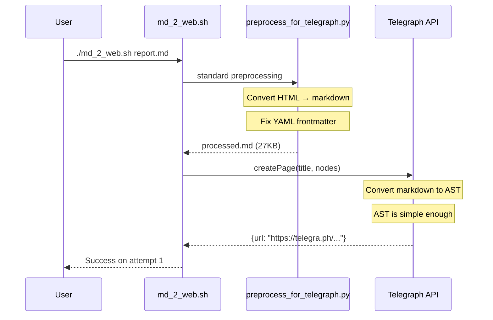
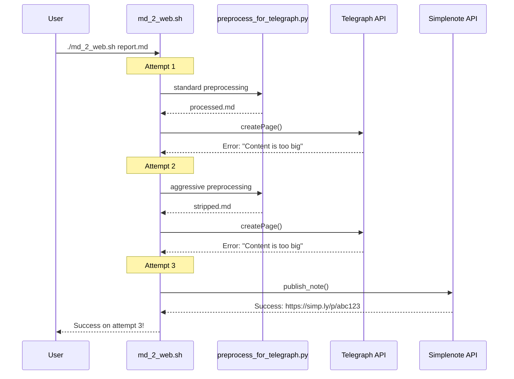

# Publishing Fallback Retry - User Flow & Architecture

> Status: IN_PROGRESS | Last updated: 2026-01-04

## System Overview

This document describes the user experience and technical flow for the publishing retry mechanism with provider order reversal and preprocessing retry levels.

---

## User Experience

### Scenario 1: Normal User (No Flags)

```
User runs: ./md_2_web.sh complex-report.md

Expected Output:
[20:15:03] Publishing to auto... (attempting Telegraph with standard preprocessing)
[20:15:08] Preprocessing with mode: standard... ✓
[20:15:23] Telegraph publish failed: Content is too big
[20:15:23] → Retrying with Telegraph + aggressive preprocessing...
[20:15:25] Preprocessing with mode: aggressive... ✓
[20:15:40] Telegraph publish failed: Content is too big
[20:15:40] → Switching provider to Simplenote...
[20:15:42] Simplenote publish success! 
[20:15:42] URL: https://simp.ly/p/abc123

Summary: Succeeded on attempt 3 (Simplenote, standard preprocessing)
```

**User Perception:** "It just worked after trying a few different approaches"

---

### Scenario 2: User Forces Specific Mode

```
User runs: ./md_2_web.sh --preprocess aggressive report.md

Expected Output:
[20:16:10] Publishing to auto... (attempting Telegraph with aggressive preprocessing)
[20:16:12] Preprocessing with mode: aggressive... ✓
[20:16:28] Telegraph publish success!
[20:16:28] URL: https://telegra.ph/Report-Title-01-04
```

**User Perception:** "I forced aggressive mode and it worked on first try"

---

### Scenario 3: Complete Failure

```
User runs: ./md_2_web.sh completely-broken.md

Expected Output:
[20:17:10] Publishing to auto... (attempting Telegraph with standard preprocessing)
[20:17:12] Preprocessing with mode: standard... ✓
[20:17:42] Telegraph publish failed: timeout
[20:17:42] → Retrying with Telegraph + aggressive preprocessing...
[20:17:44] Preprocessing with mode: aggressive... ✓
[20:18:14] Telegraph publish failed: timeout
[20:18:14] → Switching provider to Simplenote...
[20:18:16] Simplenote publish failed: timeout
[20:18:16] → Retrying with Simplenote + aggressive preprocessing...
[20:18:18] Simplenote publish failed: timeout
[20:18:18] ❌ All 4 attempts failed. Last error: timeout
```

**User Perception:** "The service seems to be down, I should check my connection"

---

## Technical Flow

### Publishing Pipeline Architecture

```mermaid
graph TB
    A[User: md_2_web.sh report.md] --> B{Has --preprocess flag?}
    B -->|Yes| C[Use specified mode only]
    B -->|No| D[Enable AUTO-RETRY mode]
    
    D --> E[Attempt 1: Telegraph + STANDARD]
    E --> F{Success?}
    F -->|Yes| G[Return URL]
    F -->|No| H{Telegraph "too complex" error?}
    
    H -->|Yes| I[Attempt 2: Telegraph + AGGRESSIVE]
    H -->|No| I
    
    I --> J{Success?}
    J -->|Yes| G
    J -->|No| K[Attempt 3: Simplenote + STANDARD]
    
    K --> L{Success?}
    L -->|Yes| G
    L -->|No| M[Attempt 4: Simplenote + AGGRESSIVE]
    
    M --> N{Success?}
    N -->|Yes| G
    N -->|No| O[Return error: all failed]

    C --> P[Attempt with specified mode]
    P --> Q{Success?}
    Q -->|Yes| G
    Q -->|No| O
```

---

### Sequence: Successful Attempt #1 (Telegraph + Standard)



---

### Sequence: Successful Attempt #3 (Simplenote + Standard)



---

## Failure Modes & Detection

### Telegraph "Too Complex" Error Detection

The Telegraph API can fail in these ways:

| Error Pattern | HTTP Code | Trigger Action |
|---------------|-----------|----------------|
| "Content is too big" | 413 | Retry with aggressive mode |
| "File too large" | 413 | Retry with aggressive mode |
| "REQUEST_ENTITY_TOO_LARGE" | 413 | Retry with aggressive mode |
| Timeout/no response | (timeout) | Retry with next combination |
| Auth failure | 401 | Stop immediately (don't retry) |
| Rate limit | 429 | Retry with backoff |

### Simplenote Error Detection

Simplenote is more permissive, but can fail:

| Error Pattern | HTTP Code | Trigger Action |
|---------------|-----------|----------------|
| Auth failure | 401 | Stop immediately |
| Network timeout | (timeout) | Retry with aggressive mode |
| Rate limit | 429 | Retry with backoff |

---

## Data Flow

### Request Flow

```
User Input:
├── markdown_file: Path to .md file
└── --preprocess: optional (standard|aggressive|minimal|off)
    └─ If not provided → "auto" retry mode

CLI Processing:
├── Read markdown file
├── If --preprocess specified:
│   └── Use that mode for single attempt
└── If --preprocess NOT specified:
    └── Enter AUTO-RETRY mode

AUTO-RETRY Loop:
├── Attempt 1: Telegraph + standard preprocessing
├── Attempt 2: Telegraph + aggressive preprocessing
├── Attempt 3: Simplenote + standard preprocessing
└── Attempt 4: Simplenote + aggressive preprocessing

Each attempt:
├── Run preprocess_for_telegraph_v2.py with mode
├── Call publish_with_provider(provider, preprocessed_content)
├── If success → return URL and exit
└── If fail → log failure and continue to next attempt
```

### Response Flow

```
Success Response:
{
  "ok": true,
  "url": "https://telegra.ph/..." | "https://simp.ly/p/...",
  "diagnostics": { ... },
  "warnings": ["Fell back to aggressive", ...],
  "attempts": {
    "total": 1-4,
    "successful": {
      "provider": "telegraph",
      "preprocessing": "aggressive"
    }
  }
}

Failure Response:
{
  "ok": false,
  "error": "All 4 attempts failed",
  "code": 3,
  "attempts": {
    "total": 4,
    "failures": [
      {"provider": "telegraph", "mode": "standard", "error": "..."},
      {"provider": "telegraph", "mode": "aggressive", "error": "..."},
      {"provider": "simplenote", "mode": "standard", "error": "..."},
      {"provider": "simplenote", "mode": "aggressive", "error": "..."}
    ]
  }
}
```

---

## Preprocessing Pipeline

### Standard Mode (Attempt 1 & 3)

```python
# What it does:
1. Strip YAML frontmatter
2. Fix critical word-breaking issues
3. Convert HTML to markdown WHERE POSSIBLE
   - <strong> → **text**
   - <em> → *text*
   - <a href="..."> → [text](url)
4. Preserve structure where conversion not possible
5. Clean up nested lists and tables

# Input: complex-report.md (27KB, mixed HTML+MD)
# Output: processed-report.md (25KB, mostly markdown)
# Success rate: 60-70% with Telegraph
```

### Aggressive Mode (Attempt 2 & 4)

```python
# What it does:
1. Strip YAML frontmatter
2. Fix critical word-breaking issues
3. REMOVE ALL HTML tags (completely strip)
   - <div>...</div> → (completely removed)
   - <span>...</span> → (completely removed)
4. Leave only pure markdown structure
5. Simplify nested content aggressively

# Input: complex-report.md (27KB, mixed HTML+MD)
# Output: stripped-report.md (18KB, pure markdown only)
# Success rate: 85-95% with any provider
# Cost: Loses some formatting/styling
```

---

## Monitoring & Observability

### Metrics to Track

Each publish attempt should log:

```json
{
  "timestamp": "2026-01-04T20:18:16Z",
  "event": "publish_attempt",
  "file": "complex-report.md",
  "attempt_number": 2,
  "provider": "telegraph",
  "preprocessing": "aggressive",
  "success": false,
  "error": "Content is too big",
  "duration_ms": 2543
}
```

### Success Rate Dashboard

Target metrics to monitor:

| Metric | Target | Action if Failing |
|--------|--------|-------------------|
| Attempt 1 success | >60% | Improve standard preprocessing |
| Attempt 2 success | >80% | None (fallback working) |
| Attempt 3 success | >90% | Consider adding more modes |
| Attempt 4 success | >95% | Alert if below |
| Total failure | <5% | Investigate content types |

---

## Rollout & Testing Strategy

### Phase 1: Shadow Mode
- Deploy retry logic behind feature flag
- Log what WOULD happen, but don't execute
- Verify detection logic is correct

### Phase 2: Dry Run
- Execute retry chain, return first successful result
- Log all attempts for analysis
- Keep backward compatible behavior visible

### Phase 3: Full Deployment
- Enable retry chain by default
- Monitor success rates and retry distribution
- Adjust retry order based on real data

---

## Integration Points

### Existing Code Paths

```
Current Call Path (needs modification):
cli.ts → shell.exec(md_2_web.sh) → cli.py → publish_with_provider()

New Call Path:
cli.ts → shell.exec(md_2_web.sh) → enhanced_cli.py → retry_publish()
    ↓
    ├── preprocess_with_retry() [NEW]
    └── publish_with_provider() [EXISTING - no change]
```

### Files to Modify

1. `/home/almaz/TOOLS/publish_to_web/src/publish_to_web/cli.py`
   - Add `retry_publish()` function as wrapper
   - Keep `publish_with_provider()` unchanged
   - Add retry loop logic

2. `/home/almaz/TOOLS/publish_to_web/md_2_web.sh`
   - May need minor updates to pass metadata
   - Keep preprocessing invocation as-is

3. (Optional) Caller scripts that invoke md_2_web.sh
   - Update to expect new response format with attempt info