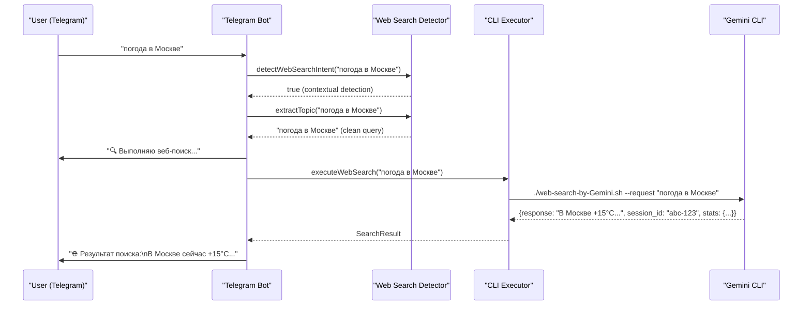
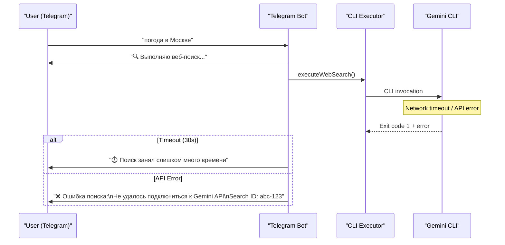

# UI Flow: Web Search via Gemini CLI

## 📖 User Journey

### Overview
Users trigger web searches through natural language in Telegram. The system automatically detects search intent, executes the search via Gemini CLI, and returns results with clear visual distinction.

---

## 🎭 Use Cases

### UC-001: Contextual Web Search (Most Common)
**Trigger:** User asks about current information without explicit search keywords



**Timeline:**
- Detection: <100ms
- Acknowledgment: Immediate
- Execution: 5-10 seconds
- Delivery: <1 second

---

### UC-002: Search Error Handling


---

## 💬 Message Templates

### MT-001: Search Acknowledgment
```
🔍 Выполняю веб-поиск...
```

### MT-002: Search Result
```
🌐 Результат поиска:
[Response from Gemini in Russian]
```

**Example:**
```
🌐 Результат поиска:
В Москве сейчас +15°C, переменная облачность. 
Ветер северо-западный 3 м/с, влажность 65%.
```

### MT-003: Search Error
```
❌ Ошибка поиска:
[User-friendly error message]
Search ID: [session_id]
```

### MT-004: Timeout
```
⏱️ Поиск занял слишком много времени
```

---

## 📊 Flow Metrics

| Metric | Target | Description |
|--------|--------|-------------|
| Detection time | <100ms | Regex pattern matching |
| Acknowledgment time | <500ms | Message send to Telegram |
| Execution time | 5-10s typical, <30s max | Total search time |
| Result delivery | <1s | Formatting and sending |

---

## 💬 Example Interactions

### Happy Path
```
User: погода в Париже
Bot:  🔍 Выполняю веб-поиск...
[7 seconds later]
Bot:  🌐 Результат поиска:
      В Париже сейчас +18°C, ясная погода.
```

### Error: Network
```
User: погода в Москве
Bot:  🔍 Выполняю веб-поиск...
[10 seconds later]
Bot:  ❌ Ошибка поиска:
      Не удалось подключиться к Gemini API
      Search ID: abc-123-def-456
```

### No Search
```
User: привет, как дела?
Bot:  Привет! У меня всё отлично.
```
**Note:** No search triggered